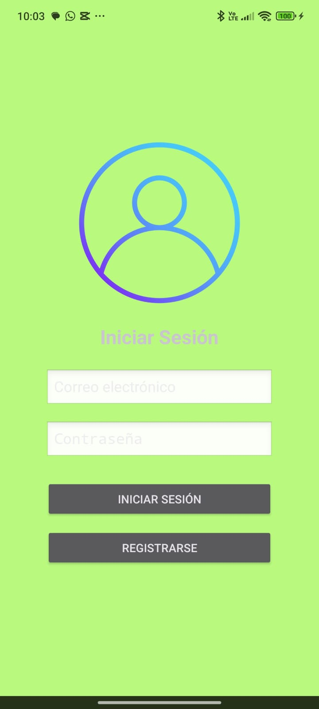
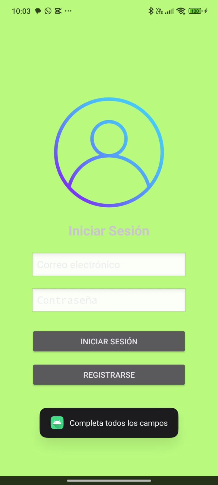
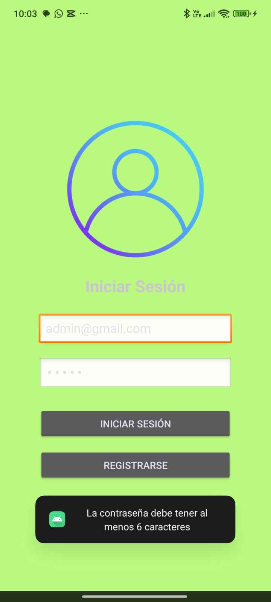
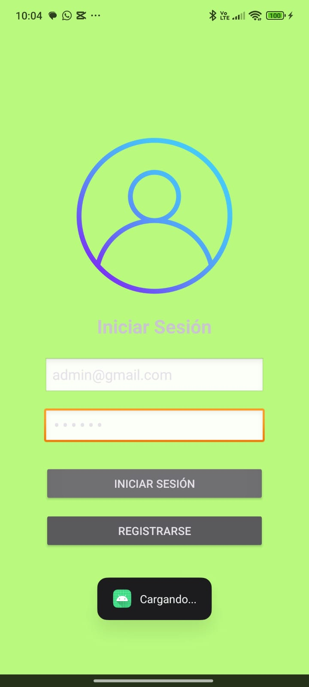
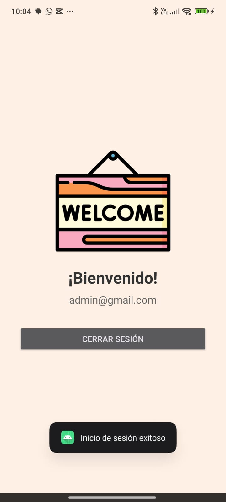

# S12Briceno_LiveData – App Móvil con Login usando Firebase y LiveData

`S12Briceno_LiveData` es una aplicación móvil Android desarrollada en Kotlin como parte del curso de Aplicaciones Móviles. Este proyecto implementa un **sistema de login con autenticación usando Firebase** y demuestra el uso del patrón **MVVM** con **LiveData** para reaccionar a cambios en el estado de la sesión de forma eficiente y desacoplada.

La app permite a los usuarios **registrarse** y **autenticarse** con su correo electrónico. Al iniciar sesión exitosamente, se les muestra una pantalla de bienvenida personalizada. Todo esto se maneja mediante Firebase Authentication y LiveData para actualizar la interfaz según el estado del login.

Este trabajo fue desarrollado como parte de la **Semana 12** para el curso de Aplicaciones Moviles Unidad III, enfocada en practicar arquitectura MVVM y uso de LiveData.

---

## 📸 Capturas de pantalla
| 🟢 **Login Inicial** | 🟢 **Validación - Email vacío** | 🟢 **Validación - Contraseña vacía** |
|----------------------|-------------------------------|--------------------------------------|
|  |  |  |

| 🔄 **Estado: Cargando (LiveData)** | ✅ **Estado: Completado (LiveData)** |
|-----------------------------------|--------------------------------------|
|  |  |

---

## 📱 Características
- Registro de usuario con correo y contraseña.
- Autenticación segura usando Firebase.
- Navegación automática a una pantalla de bienvenida tras login exitoso.
- Uso de LiveData para mostrar mensajes y redirigir vistas desde ViewModel.
- Validación básica de campos.
- Diseño visual con imagen de fondo e íconos amigables.

---

## 🛠️ Tecnologías utilizadas
- Kotlin
- Android Studio
- Firebase Authentication
- LiveData + ViewModel (arquitectura MVVM)
- XML Layouts
- Intents y navegación entre Activities

---

## 🔧 Estructura principal del proyecto
- `LoginActivity.kt`: Pantalla principal donde el usuario inicia sesión o se registra.
- `LoginViewModel.kt`: Encapsula la lógica de login/registro usando Firebase y expone un LiveData para observar el estado.
- `LoginResult.kt`: `sealed class` para representar estados del proceso (Cargando, Exitoso, Error).
- `BienvenidaActivity.kt`: Pantalla mostrada al usuario tras autenticarse, con su correo e imagen.
- `activity_login.xml`: Layout del formulario de login/registro.
- `activity_bienvenida.xml`: Layout con mensaje de bienvenida y botón para cerrar sesión.

---

## Live Data
LiveData se utiliza en este proyecto como parte del patrón de arquitectura **MVVM** para gestionar y observar los estados del proceso de autenticación (inicio de sesión y registro) de manera reactiva y desacoplada.

- En el `LoginViewModel`, se define una variable:
  ```kotlin
  private val _loginState = MutableLiveData<LoginResult>()
  val loginState: LiveData<LoginResult> = _loginState

---

## 🧪 Cómo ejecutar el proyecto
1. Clona el repositorio o abre el proyecto en Android Studio.
2. Asegúrate de tener configurado Firebase con tu archivo `google-services.json`.
3. Activa **Email/Password** en el panel de Firebase Authentication.
4. Ejecuta el proyecto en un emulador o dispositivo físico.
5. Regístrate o inicia sesión con un correo válido.
